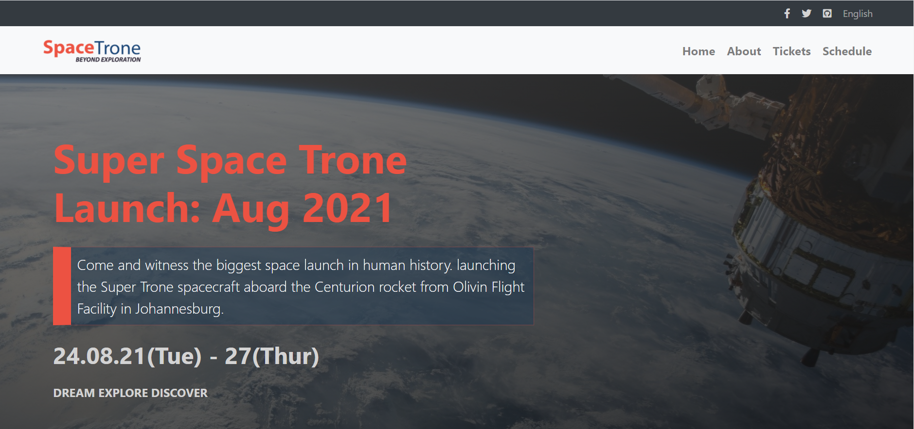

# HTML & CSS Capstone Project: Space Trone Launch Confrence 2021



> This project Project is based on an online website for a conference.
> I built a website for the Space Mission Launch.

# The Project has the following pages

    - the Home page, with a menu link to the about page, tickets, and the schedule page
    - the about page
    - the tickets page
    - the schedule page

# Responsive Design with emphasis on

    - mobile: up to 768px
    - desktop: from 768px

# Built With

    - HTML
    - CSS
    - Bootstrap

## Live Demo

[Live Demo Link](https://bigwizzo.github.io/html-css-capstone)

## Getting Started

To get a local copy up and running follow these simple example steps.

### Prerequisites

> Browser
> Text editor of your choice
> npm has to be installed in your system

### Setup

> `git clone https://github.com/BigWizzo/html-css-capstone.git`

### Usage

> Open the index.html from your browser.

### Run tests

Run `npx html-validator-cli --quiet --file index.html` to run the validator over the `index.html` file.

The `--quiet` will only list `errors`. If you also want to see the warnings use the `--verbose` flag instead.
As an alternative, you can also install the `html5validator` using `pip`:

```
pip install --user html5validator
html5validator index.html
```

## Authors

- Github: [@bigwizzo](https://github.com/bigwizzo)

## 🤝 Contributing

Contributions, issues and feature requests are welcome!

Feel free to check the [issues page](https://github.com/BigWizzo/html-css-capstone/issues/).

## Show your support

Give a ⭐️ if you like this project!

## 📝 License

This project is [MIT](https://opensource.org/licenses/MIT) licensed.
